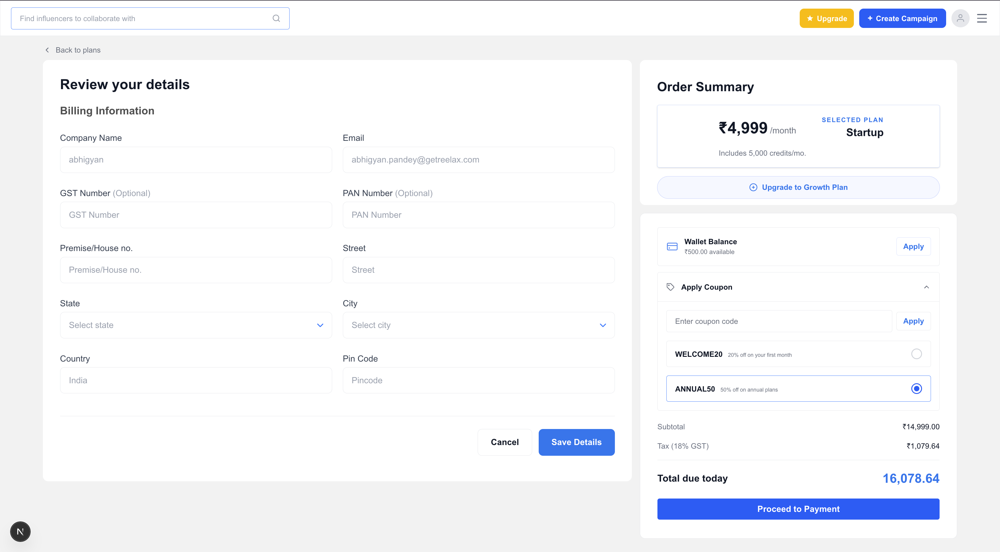

# Reelax – Checkout Page UI

> A pixel-perfect checkout page UI built as part of the Reelax Frontend Developer Internship Assignment. Features a billing information form, order summary panel, wallet balance, and coupon code functionality.



---

## 🔗 Links

📂 [GitHub Repository](https://github.com/Udman06/Reelax-Assignment) &nbsp;|&nbsp; 👉 [Live Demo](#) <!-- Replace with Vercel URL after deploying -->

---

## 📌 About the Project

This project is a checkout/billing page UI for Reelax — an influencer marketing platform. The page allows users to review their billing details, apply wallet balance or coupon codes, and view a real-time order summary before confirming their plan purchase.

**Key highlights:**
- Billing form with fields for company info, GST, PAN, and address details
- Order summary panel showing selected plan, pricing, tax (18% GST), and total
- Coupon code section with selectable discount options (e.g. WELCOME20, ANNUAL50)
- Wallet balance display with one-click apply
- Clean, responsive layout matching the Reelax product design

---

## ⚙️ Tech Stack

| Category     | Technology         |
|--------------|--------------------|
| Framework    | Next.js 14 (App Router) |
| Language     | JavaScript (JSX)   |
| Styling      | CSS Modules / Tailwind CSS |
| Deployment   | Vercel             |

---

## 🚀 Getting Started

### Prerequisites

- Node.js v18+
- npm

### Installation

```bash
# Clone the repository
git clone https://github.com/Udman06/Reelax-Assignment.git

# Navigate into the project
cd Reelax-Assignment

# Install dependencies
npm install

# Run the development server
npm run dev
```

Open [http://localhost:3000/check-out](http://localhost:3000/check-out) in your browser.

---

## 📁 Project Structure

```
├── app/
│   ├── layout.js           # Root layout
│   ├── page.js             # Home / entry point
│   └── check-out/
│       └── page.js         # Checkout page
├── components/
│   ├── BillingForm.jsx     # Billing information form
│   ├── OrderSummary.jsx    # Pricing, coupon & wallet section
│   └── Navbar.jsx          # Top navigation bar
├── public/
│   └── screenshot.png      # Project screenshot
└── styles/                 # Global and module styles
```

---

## 💡 Design Decisions

- **Next.js App Router** was used to keep the project aligned with modern React patterns and enable easy route-based structure (`/check-out`).
- **Component separation** — Billing form and Order Summary are kept as independent components to maintain separation of concerns and make them reusable.
- **Coupon logic** is handled via local state, keeping it lightweight without needing an external state manager for this scale.

---

## 🔮 What I'd Improve With More Time

- [ ] Form validation with error messages (required fields, PAN/GST format)
- [ ] Real coupon discount applied dynamically to the total
- [ ] Mobile responsiveness polish
- [ ] Accessibility improvements (ARIA labels, keyboard navigation)

---

## 👤 Author

**Udman**
📂 [GitHub – Udman06](https://github.com/Udman06)
